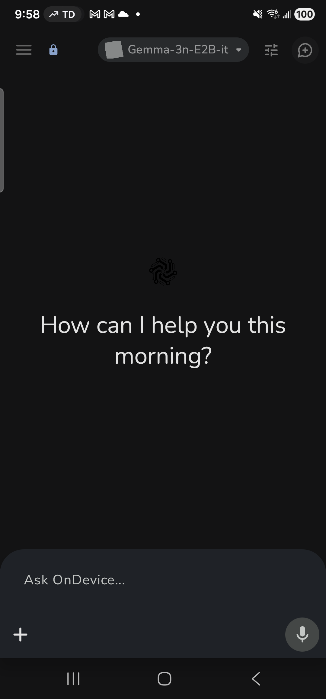
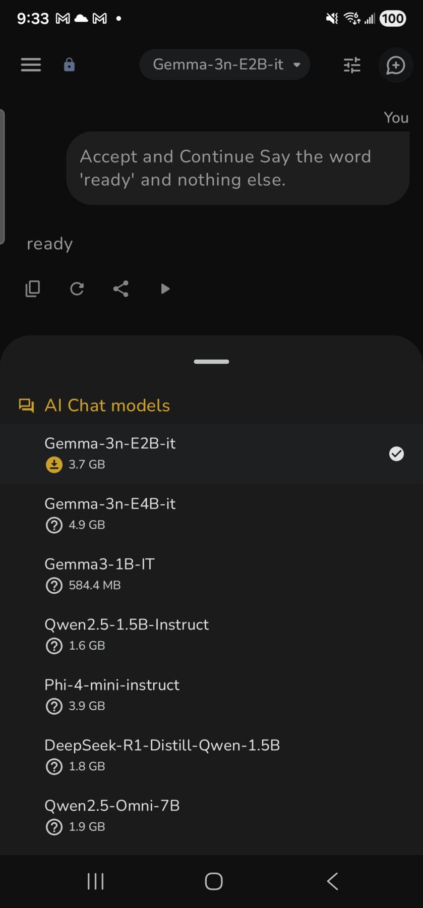
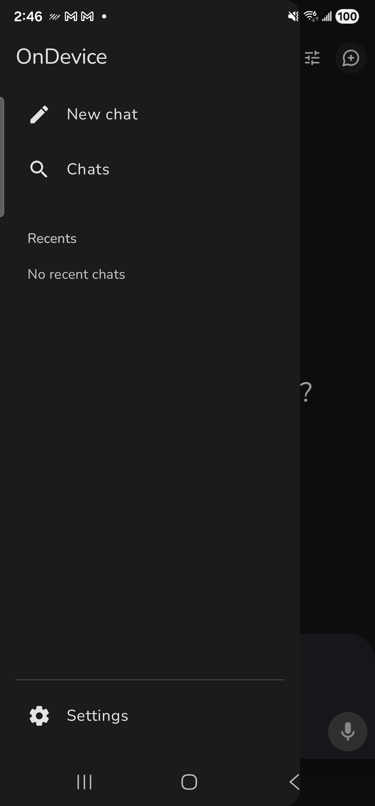
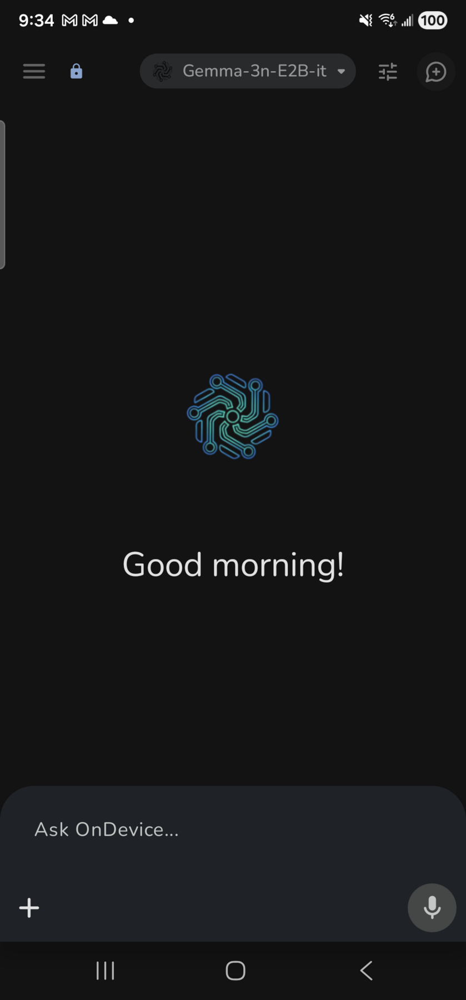
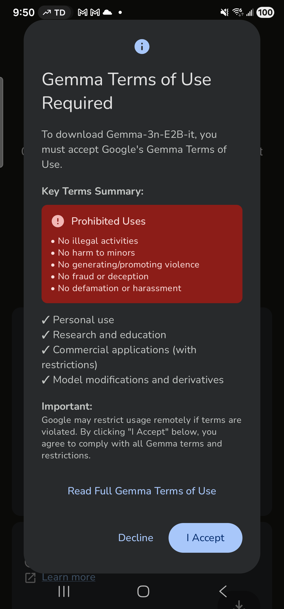
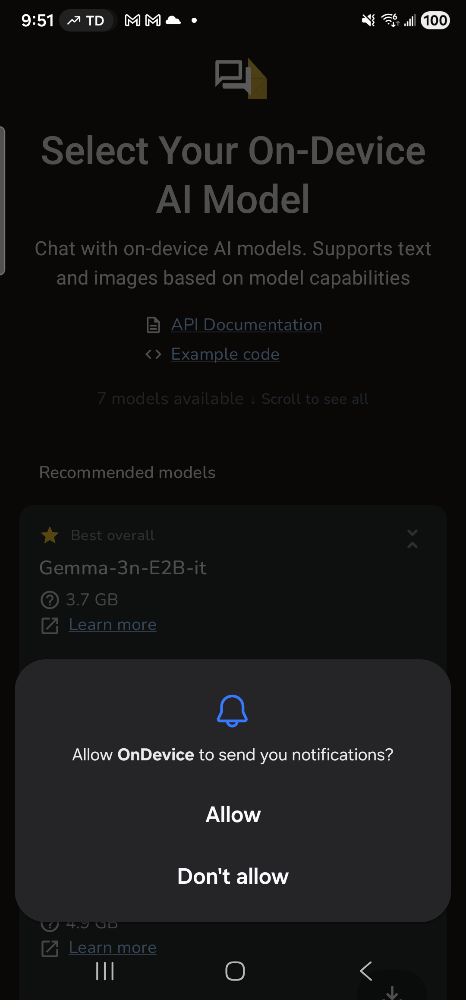

# OnDevice AI v1.1.9 - Complete OpenSpec Documentation

**Status**: ✅ PROJECT COMPLETE (All 6 Phases)

**Version**: 1.1.9 (Build 35)

**Repository**: https://github.com/on-device-ai-inc/on-device-ai

---

## 🎨 Visual Assets

  

**Logos**: [`assets/logos/`](assets/logos/)
- `ondevice_logo_full.png` - Full brand logo (557 KB)
- `neural_circuit_logo.png` - Neural circuit icon (43 KB)
- `app_icon.png` - App launcher icon (14 KB)
- `app_icon_foreground.png` - Icon foreground layer (63 KB)

**Screenshots**: [`assets/screenshots/`](assets/screenshots/)
- Chat screen (active conversation)
- Conversation list (history)
- Settings screen
- Empty chat (welcome state)
- Model download screens

<b>📸 View Screenshots</b>

### Chat Screen

*Active conversation with AI model showing message bubbles and input area*

### Conversation List

*History of past conversations with search and starred items*

### Settings Screen

*App settings with theme, text size, and privacy controls*

### Empty Chat (Welcome State)

*Initial chat screen before any messages*

### Model Download

*Model download in progress with percentage indicator*

### Download Progress

*Detailed download progress with file size and speed*

---

## 📋 Quick Navigation

| Phase | File | Pages | Description |
|-------|------|-------|-------------|
| **1** | [OPENSPEC-FOUNDATION.md](OPENSPEC-FOUNDATION.md) | 75 | Product, typography, colors, navigation, database, architecture |
| **2** | [OPENSPEC-SCREENS.md](OPENSPEC-SCREENS.md) | 40 | All 14 screens with layouts, states, logic |
| **3** | [OPENSPEC-LOGIC.md](OPENSPEC-LOGIC.md) | 40 | State machines, algorithms, business logic |
| **4** | [OPENSPEC-FEATURES.md](OPENSPEC-FEATURES.md) | 45 | Custom tasks, history, settings, privacy, storage |
| **5** | [OPENSPEC-NFR.md](OPENSPEC-NFR.md) | 50 | Performance, errors, offline, analytics, security |
| **6** | [OPENSPEC-ASSETS.md](OPENSPEC-ASSETS.md) | 55 | Assets, strings, dimensions, themes |

---

## What is OpenSpec?

OpenSpec is a **deterministic specification methodology** that eliminates all ambiguity from software specifications.

**Goal**: Two independent engineering teams can rebuild OnDevice AI **identically** without asking clarifying questions.

**Method**: Every value is explicit, every algorithm is pseudocode, every threshold is exact, every source is cited.

---

## Project Statistics

**Total**: 285 pages, ~14,000 lines

**Coverage**:
- ✅ 14 screens documented
- ✅ 8 state machines with diagrams
- ✅ 12 algorithms with pseudocode
- ✅ 92 colors (Material Design 3)
- ✅ 142 string resources (WCAG 2.2 AA)
- ✅ 38 asset files (1.89 MB)
- ✅ 15+ error types
- ✅ Complete offline behavior
- ✅ Full security specifications

---

## How to Use

### For Product Managers
Read specifications to understand current implementation → Define new features using same level of detail → Hand off to engineering with zero ambiguity

### For Engineers
Copy pseudocode algorithms directly → Implement using exact thresholds → No design decisions needed

### For QA/Testers
Derive test cases from state machines → Verify exact thresholds → Check error messages match What+Why+Action format

### For Designers
Use exact typography (Nunito, 8 weights) → Apply color tokens (92 total) → Follow spacing system (4dp base) → Match existing patterns

---

## Deterministic Guarantee

**Every value sourced from code**:
- ✅ Exact thresholds: 3,072 tokens (not "mostly full")
- ✅ Exact formulas: `tokens = text.length / 4`
- ✅ Exact dimensions: 54dp, 24dp, 72dp (not "medium", "rounded")
- ✅ Exact colors: #FF0B57D0 (not "blue")
- ✅ File paths with line numbers for all values

---

## Repository

**GitHub**: https://github.com/on-device-ai-inc/on-device-ai

**License**: Apache 2.0

---

🎉 **PROJECT COMPLETE - All 6 phases finished!**
